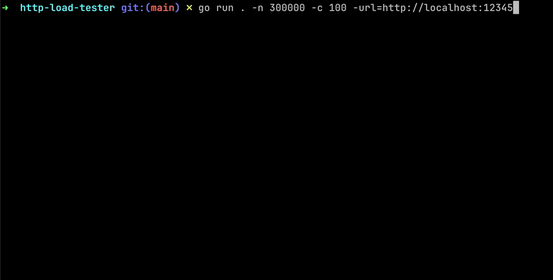

# HTTP Load Tester

- An HTTP Load Tester written in Go which supports concurrent requests, and outputs important metrics
- Check if your system handles concurrent load properly, or if your rate limiting works correctly



### Usage
```
Options
  -n int
    	Total number of requests to make (default: 5)
  -c int
    	Number of concurrent requests (default: 1)
  -url string
    	Endpoint URL for load testing
```

#### Example
```bash
$ go build .
$ ./http-load-tester -n 1000 -c 100 -url=http://localhost:12345
```

### Installation
```bash
$ git clone https://github.com/me-heer/http-load-tester.git
$ cd http-load-tester
$ go build .
$ ./http-load-tester -n 1000 -c 100 -url=http://localhost:12345
```

### Sample HTTP Server
- If you need, `sample_http_server/` has a test http server which you can use to observe the behavior of HTTP Load Tester.
- Start the sample HTTP Server by: `go run sample_http_server/http_server.go`

### Notes
- There is no limit on the number of concurrent requests you can send. However, the number of parallel requests will mostly be determined by your system's CPU. Hence, `-c` flag can also be interpreted as "roughly parallel requests"
- Please be responsible while load testing websites and only send requests to servers that you own/have permission to do so. If you're curious about sending large amounts of requests, you can use `sample_http_server/http_server.go`.
- Idea inspired by: https://codingchallenges.fyi/challenges/challenge-load-tester

### Motivation
- I wanted to experiment with Golang more
- `"The first step in acquiring any new skill is not being able to do your own thing but being able to reproduce what other people have done before you. This is the quickest way to mastering a skill."` - Joe Armstrong, Creator of Erlang
